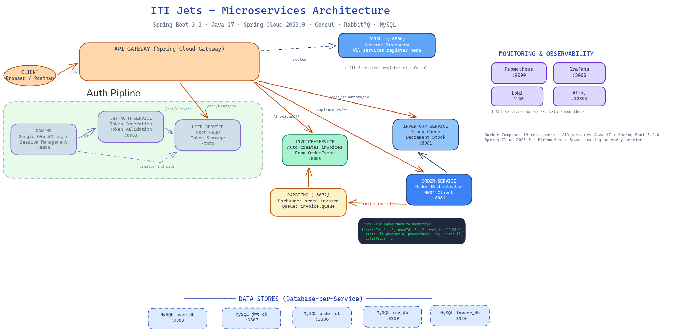

# ITI Jets — Microservices Architecture

microservice arch project, that separate the deployment form the volume(state) and keeps the arch scalabel as much as possible.
solving non-byzantine issues, and covering the fundmental battle between languges.i used the cheapest model outhere(i am borke tbh).
you are open to fork and make your own oc(but mention me ;)

as a local first advocate, the setup is quite simple

## local start as always

```bash
# ensure .env has Google OAuth credentials
docker compose up --build
```

Open http://localhost:8060 and start ordering.

## Arch

<p align="center">
  
</p>

> Editable diagram: open [`architecture.excalidraw`](architecture.excalidraw) at https://excalidraw.com

## Services

| Service | Port | Role |
|---|---|---|
| gateway-service | 8060 | Spring Cloud Gateway (routes via Consul) |
| consul | 8500 | Service discovery — all services register here |
| oauth2 | 8085 | Google OAuth2 login, session management |
| jwt-auth-service | 8083 | JWT token generation & validation |
| user-service | 7070 | User CRUD, token storage |
| order-service | 8082 | Order orchestrator, REST + RabbitMQ producer |
| inventory-service | 8081 | Stock check & decrement |
| invoice-service | 8084 | Auto-creates invoices from OrderEvent (RabbitMQ consumer) |
| rabbitmq | 5672 / 15672 | Message broker / Management UI |
| prometheus | 9090 | Metrics collection (scrapes `/actuator/prometheus`) |
| grafana | 3000 | Dashboards (Prometheus + Loki datasources) |
| loki | 3100 | Centralized log aggregation |
| alloy | 12345 | Docker log scraper → Loki |

## Gateway routes

| Route | Target |
|---|---|
| `/api/auth/**`, `/login/**`, `/oauth2/**`, `/` | `lb://oauth2` |
| `/api/orders/**` | `lb://order-service` |
| `/api/inventory/**` | `lb://inventory-service` |
| `/api/users/**` | `lb://user-service` |
| `/invoices/**` | `lb://invoice-service` |

## Databases (database-per-service)

| Database | Host Port | Owned By |
|---|---|---|
| `order_db` | 3306 | order-service |
| `jwt_db` | 3307 | jwt-auth-service |
| `userdb` | 3308 | user-service |
| `inventorydb` | 3309 | inventory-service |
| `invoice_db` | 3310 | invoice-service |


## Environment variables

| Variable | Required | Default | Used by |
|---|---|---|---|
| `GOOGLE_CLIENT_ID` | yes | — | oauth2 |
| `GOOGLE_CLIENT_SECRET` | yes | — | oauth2 |
| `CONSUL_HOST` | no | localhost | all services |
| `CONSUL_PORT` | no | 8500 | all services |
| `MYSQL_HOST` | no | localhost | order, invoice, user, jwt, inventory |
| `RABBITMQ_HOST` | no | localhost | order, invoice, inventory |

## Monitoring & Tracing

All Spring Boot services expose `/actuator/prometheus` for Prometheus scraping.

- **Prometheus** → http://localhost:9090
- **Grafana** → http://localhost:3000 (admin/admin)
- **Loki** → http://localhost:3100 (log queries from Grafana)
- **Alloy** scrapes Docker container logs → Loki

Distributed tracing via Micrometer + Brave with 100% sampling propagates trace/span IDs through HTTP headers and RabbitMQ messages.

